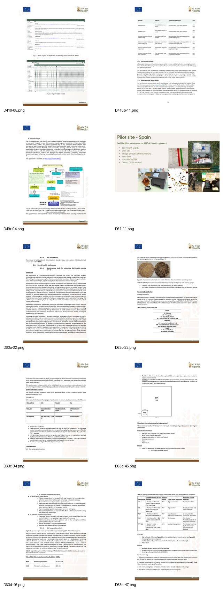

{width="55%" fig-alt="Contact illustration for the AI4SoilHealth Toolbox"}

The AI4SoilHealth Toolbox is part of the wider AI4SoilHealth public ecosystem. If you would like to learn more about the toolbox, its tools, or its digital services, the official public channels below are the best starting point.

## Official project contact route

The public AI4SoilHealth site includes a dedicated contact page with a web form for enquiries. ([Contact us](https://ai4soilhealth.eu/contact-us/))

## Public channels and useful links

| Channel | Link |
|---|---|
| Main project website | [ai4soilhealth.eu](https://ai4soilhealth.eu/) |
| Soil Health Data Cube site | [shdc.ai4soilhealth.eu](https://shdc.ai4soilhealth.eu/) |
| Contact form | [ai4soilhealth.eu/contact-us](https://ai4soilhealth.eu/contact-us/) |
| GitHub organisation | [github.com/AI4SoilHealth](https://github.com/AI4SoilHealth) |
| X / Twitter | [@AI4SoilHealth](https://twitter.com/AI4SoilHealth) |
| LinkedIn | [AI 4 Soil Health](https://www.linkedin.com/company/ai-4-soil-health/) |
| YouTube | [@AI4SoilHealth](https://www.youtube.com/@AI4SoilHealth) |
| Bluesky | [ai4soilhealth.bsky.social](https://bsky.app/profile/ai4soilhealth.bsky.social) |

## For users and interested stakeholders

You may wish to get in touch if you are interested in:

- learning more about the toolbox,
- understanding specific methods,
- discussing use cases,
- exploring collaboration,
- or contributing visual material or feedback.

## Toolbox development

This site presents the toolbox as a structured public-facing resource. Its content may continue to evolve as tools, visuals, and user guidance are refined.

::: {.note-box}
Later, this page can be adapted to include named contacts, partner-specific contact points, or a dedicated toolbox mailbox if the project decides to add them.
:::
