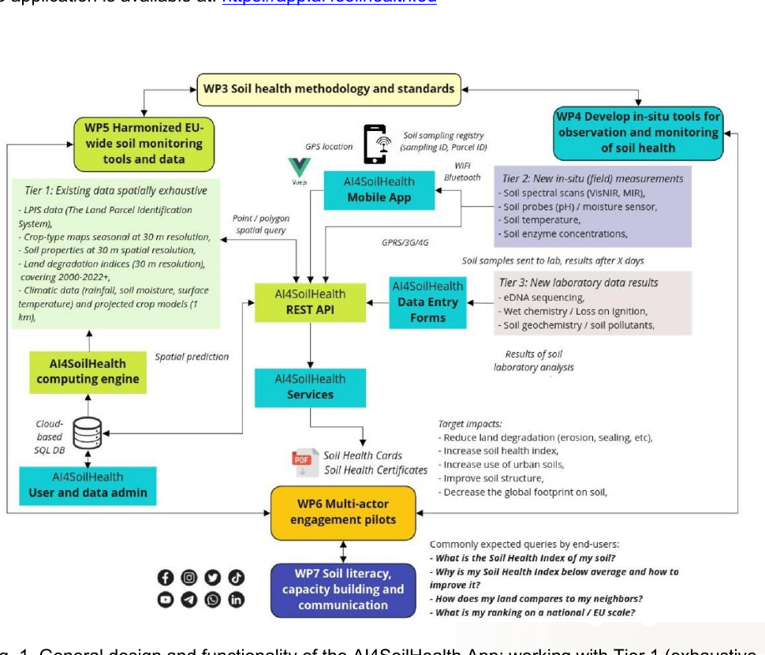
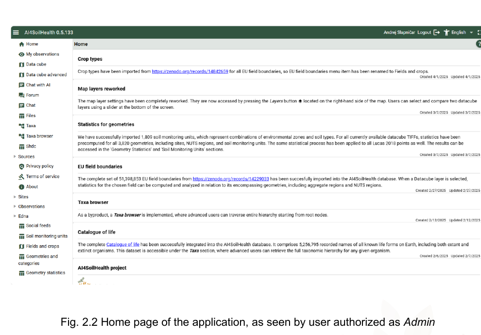
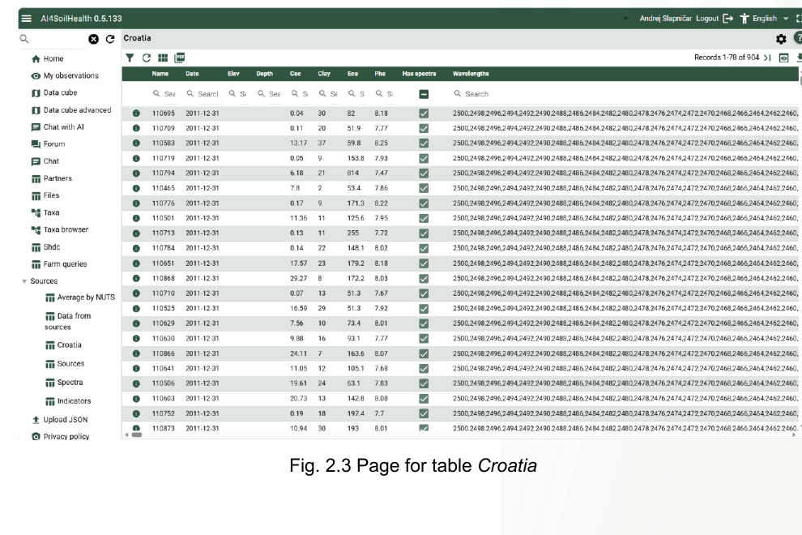

Digital services are the layer that connects measurements, observations, contextual information, and outputs.

## AI4SoilHealth App

The app provides a user-facing environment for viewing, storing, and interacting with soil-health information.

{.tool-photo width="85%" fig-alt="General architecture of the AI4SoilHealth app"}

Key roles of the app include:

- combining contextual layers with local information,
- supporting field data entry,
- storing observations and uploaded information,
- and connecting users with visual outputs.

## Field data collection modules

These modules support geolocated recording of:

- field observations,
- sample locations,
- photos,
- and selected measured variables.

## Dashboard and visualisation interface

The dashboard helps users inspect maps, tables, and site-level information.

{.tool-photo width="82%" fig-alt="Home page of the AI4SoilHealth application"}

{.tool-photo width="82%" fig-alt="Example of a data-table view in the AI4SoilHealth application"}

## Reporting outputs

The digital toolbox can support the creation of user-facing summaries, including soil-health cards and related reporting outputs.

## Supporting data layer

The toolbox is supported by a broader digital data and visualisation environment. This background layer helps users place local observations into a wider context by providing maps, layers, and comparative information.

::: {.note-box}
For communication purposes, it is useful to present this supporting data environment as a **horizontal or enabling service** that helps power the toolbox, rather than as the toolbox itself.
:::
