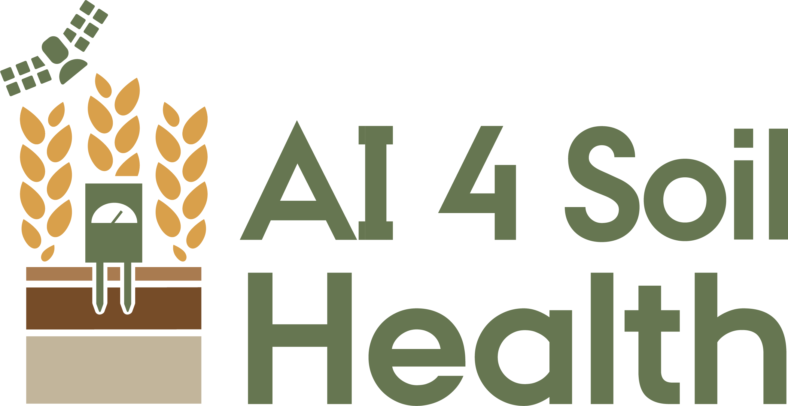
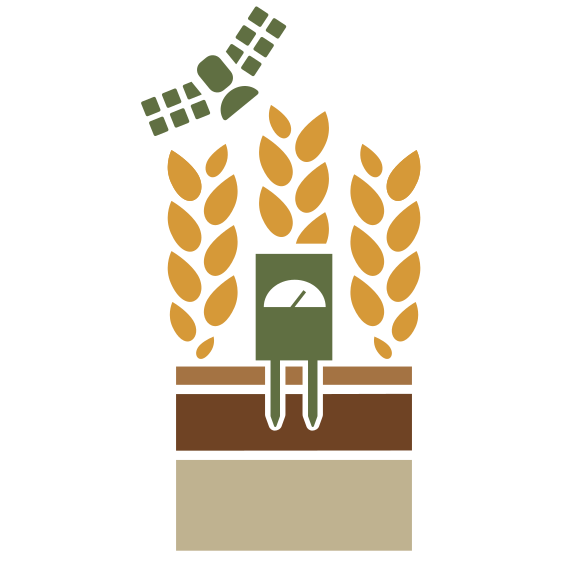
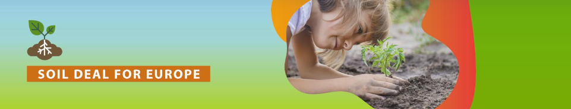
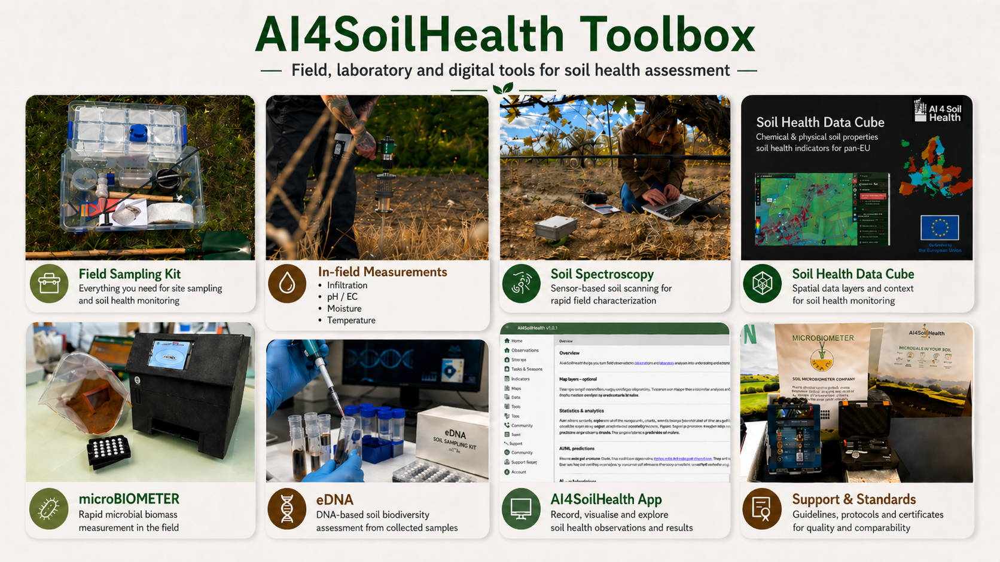
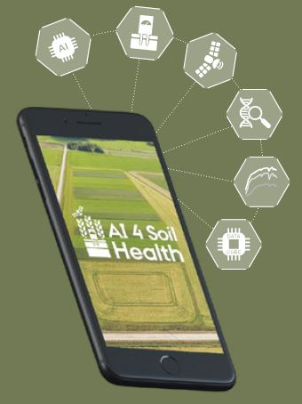
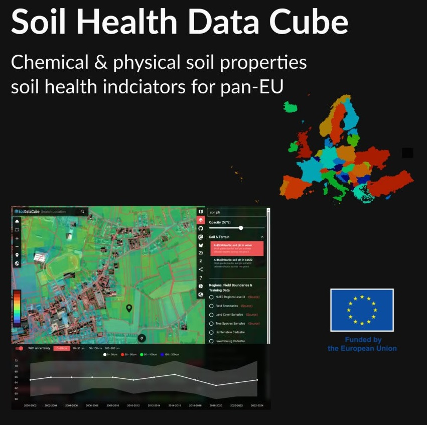
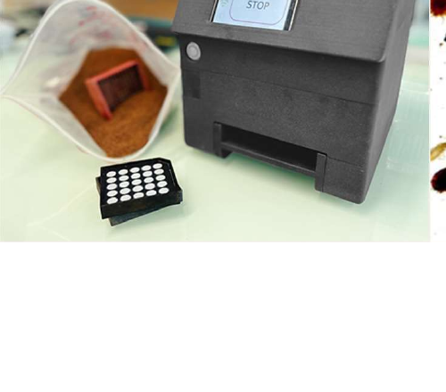

:::: {.hero}
{width="280" fig-alt="AI4SoilHealth wordmark"}

# A practical toolbox for soil health assessment and monitoring

::: {.lead}
The AI4SoilHealth Toolbox brings together field methods, laboratory approaches, digital tools, and supporting data services to help users assess soil health in a practical and structured way.
:::
::::

  
  

{.tool-photo width="84%" fig-alt="Overview collage of selected toolbox components"}

## What the toolbox helps users do

:::: {.kpi-grid}
::: {.kpi}
**Assess key soil health descriptors**  
Use field, laboratory and digital tools to assess soil health descriptors related to the physical, chemical and biological condition of soil, including salinisation, soil organic carbon, structure, nutrient status, water regulation, and biodiversity.
:::

::: {.kpi}
**Combine field, lab, and digital information**  
Move from observations and measurements to mapped information, records, and user-friendly outputs.
:::

::: {.kpi}
**Choose methods that fit the situation**  
Select between rapid field screening, laboratory approaches, and digital services depending on the assessment need.
:::

::: {.kpi}
**Support interpretation and communication**  
Use the toolbox to understand soil condition, identify possible constraints, and communicate results more clearly.
:::
::::

## Part of the wider AI4SoilHealth project

## Part of the AI4SoilHealth project

AI4SoilHealth is an EU-funded Horizon Europe project supporting the EU Soil Health Mission for 2030. It focuses on accelerating the collection and use of soil health information using AI technology to support the Soil Deal for Europe and the EU Soil Observatory.

This site presents the user-facing AI4SoilHealth Toolbox: the field methods, laboratory approaches, digital tools, and supporting services developed to help users assess soil health descriptors, record observations, interpret results, and connect local measurements with wider spatial context through services such as the Soil Health Data Cube.
## What is inside the toolbox

The toolbox combines four complementary elements:

1. **Field tools and rapid assessment methods**  
   Methods that can be used directly in the field or close to the field.

2. **Laboratory approaches**  
   Methods that provide more detailed or confirmatory soil analysis.

3. **Digital tools**  
   Tools for recording, visualising, organising, and communicating soil health information.

4. **Supporting data services**  
   Background layers and contextual information that help users interpret local observations.

## Who it is for

The toolbox is designed for users who need practical ways to assess or monitor soil health, including:

- farmers and growers,
- land managers,
- advisors and consultants,
- researchers,
- environmental professionals,
- and public authorities.

## Featured toolbox components

:::: {.tool-grid}
::: {.tool-card}
{.card-thumb alt="AI4SoilHealth App"}
[AI4SoilHealth App](tools/ai4sh-app.qmd)
Main digital environment for recording, viewing, and organising soil health information.
:::

::: {.tool-card}
{.card-thumb alt="Soil Health Data Cube"}
[Soil Health Data Cube](tools/data-cube.qmd)
Supporting digital service that provides spatial context, layers, and wider environmental information.
:::

::: {.tool-card}
{.card-thumb alt="SEAR / Digit Soil"}
[SEAR / Digit Soil](tools/sear.qmd)
Biological assessment tool focused on enzyme activity and soil functioning.
:::
::::

## Start exploring

:::: {.tool-grid}
::: {.tool-card}
### [About the Toolbox](about.qmd)
Understand the scope, purpose, and role of the AI4SoilHealth Toolbox.
:::

::: {.tool-card}
### [Tools](tools/index.qmd)
Explore the individual methods, tools, and digital services included in the toolbox.
:::

::: {.tool-card}
### [Soil Health Descriptors](descriptors.qmd)
Start from the soil issue or descriptor you want to assess.
:::

::: {.tool-card}
### [How it Works](workflow.qmd)
Follow a simple workflow from question to measurement, interpretation, and output.
:::
::::
The AI4SoilHealth Toolbox is not a single instrument or a single app. It is a combination of methods, tools, and services that can be used together to support soil health assessment and monitoring.

