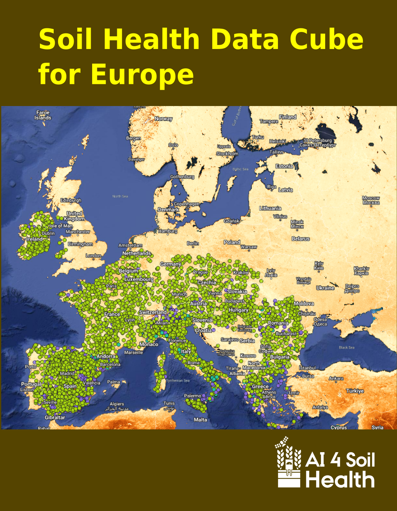
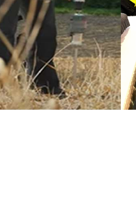
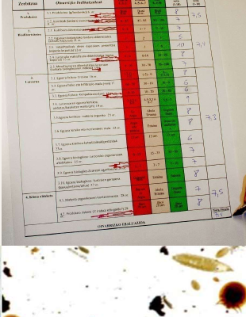

The AI4SoilHealth Toolbox includes field methods, laboratory approaches, digital tools, and supporting services. Each tool contributes differently to soil health assessment.

Some tools are suited to **rapid screening in the field**. Others provide **deeper laboratory analysis**. Digital tools help users **record, visualise, compare, and report** soil health information.

## Digital tools and services

  

    
    <h3><a href="ai4sh-app.qmd">AI4SoilHealth App</a></h3>
    
Main user-facing environment for viewing, recording, and interacting with soil health information.

  

  

    
    <h3><a href="data-cube.qmd">Soil Health Data Cube</a></h3>
    
Supporting digital service that provides contextual maps, layers, and background information.

  

## Field tools and rapid assessment methods

  

    
    <h3><a href="soil-spectroscopy.qmd">Soil Spectroscopy</a></h3>
    
Rapid, non-destructive assessment of several physicochemical soil properties.

  

  

    
    <h3><a href="vess.qmd">VESS</a></h3>
    
Visual evaluation of soil structure directly in the field.

  

  

    
    <h3><a href="aggregate-stability.qmd">Aggregate Stability</a></h3>
    
Simple methods for assessing structural stability and slaking behaviour.

  

  

    
    <h3><a href="infiltration.qmd">Infiltration Test</a></h3>
    
Field method to assess how water enters the soil and how the soil behaves hydraulically.

  

  

    
    <h3><a href="salinity-ph-ec.qmd">Salinity / pH / EC Methods</a></h3>
    
Rapid screening methods for salinity, acidity, and related chemical conditions.

  

  

    
    <h3><a href="macrofauna.qmd">Macrofauna Observation</a></h3>
    
Observation-based assessment of earthworms and other visible soil fauna.

  

## Laboratory and detailed assessment methods

  

    
    <h3><a href="lab-analysis.qmd">Standard Soil Laboratory Analysis</a></h3>
    
Reference measurements for key soil physicochemical variables.

  

  

    
    <h3><a href="bulk-density.qmd">Bulk Density Sampling</a></h3>
    
Sampling approach that supports structure, compaction, and stock-related assessment.

  

  

    
    <h3><a href="sear.qmd">SEAR / Digit Soil</a></h3>
    
Rapid measurement of extracellular enzyme activity linked to soil biological functioning.

  

  

    
    <h3><a href="microbiometer.qmd">MicroBIOMETER</a></h3>
    
Kit-based method for estimating microbial biomass and fungal/bacterial balance.

  

  

    
    <h3><a href="edna.qmd">eDNA / Metabarcoding</a></h3>
    
DNA-based workflow for soil biodiversity and biological community assessment.

  

## How to use this catalogue

Each tool page explains:

- what the tool is,
- why a user would use it,
- where it is used,
- which target variables it addresses,
- which soil health descriptors it supports,
- and what kind of output a user can expect.
