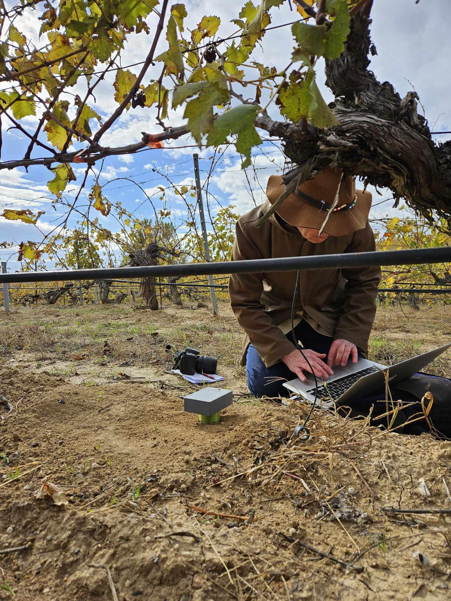
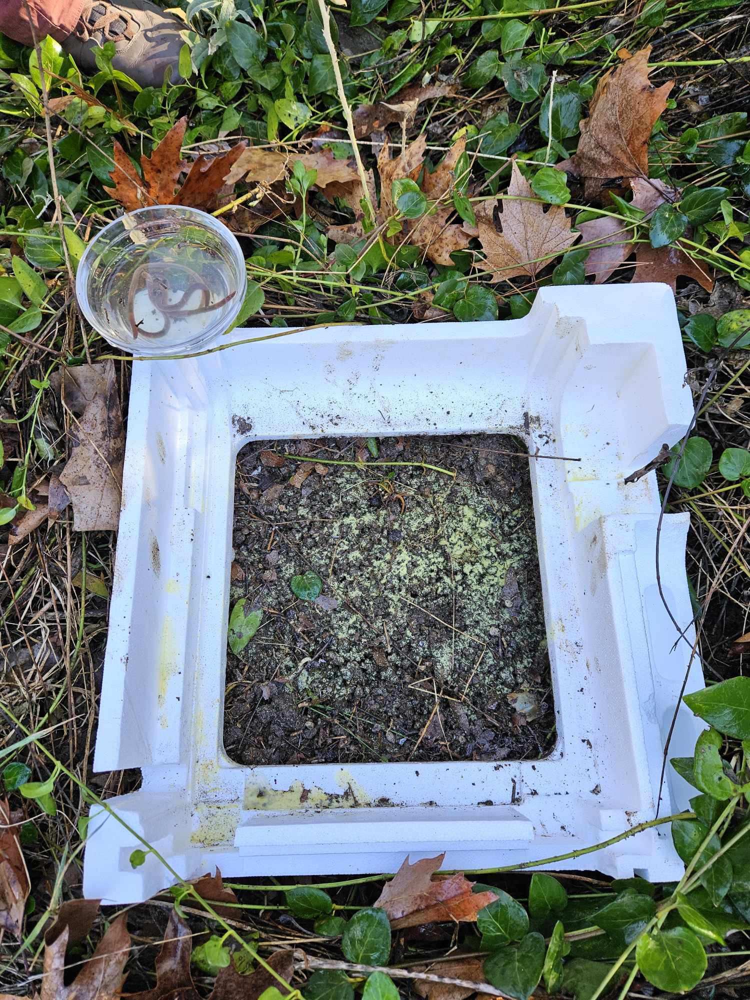
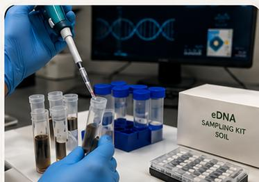

The AI4SoilHealth Toolbox combines field methods, laboratory approaches, digital tools, and supporting services for soil health assessment and monitoring.

Each toolbox component supports the assessment of one or more **soil health descriptors**, covering the **physical, chemical, and biological** dimensions of soil health. Some methods are designed for **rapid field screening**, others provide **deeper laboratory analysis**, and digital services help users **record, visualise, compare, and communicate** soil health information.

## Digital tools and services

:::: {.tool-grid}
::: {.tool-card}
{.card-thumb alt="AI4SoilHealth app"}
[AI4SoilHealth App](ai4sh-app.qmd)
Main user-facing environment for recording, viewing, and interacting with soil health information.
:::

::: {.tool-card}
{.card-thumb alt="Soil Health Data Cube"}
[Soil Health Data Cube](data-cube.qmd)
Supporting digital service that provides contextual maps, spatial layers, and background information for soil health monitoring.
:::
::::

## Field tools and rapid assessment methods

:::: {.tool-grid}
::: {.tool-card}
{.card-thumb alt="Soil spectroscopy"}
[Soil Spectroscopy](soil-spectroscopy.qmd)
Rapid, non-destructive assessment method for screening key soil physicochemical properties in support of soil health monitoring.
:::

::: {.tool-card}
{.card-thumb alt="Infiltration test"}
[Infiltration Rate](infiltration.qmd)
Field method used to assess water entry, infiltration behaviour, and related physical soil functioning.
:::

::: {.tool-card}
{.card-thumb alt="Salinity, pH and EC methods"}
[Salinity / pH / EC Methods](salinity-ph-ec.qmd)
Rapid screening methods for salinity, acidity, and related chemical soil conditions.
:::

::: {.tool-card}
{.card-thumb alt="Macrofauna observation"}
[Macrofauna Observation](macrofauna.qmd)
Observation-based assessment of earthworms and other visible soil fauna as indicators of soil biological condition.
:::
::::

## Laboratory and detailed assessment methods

:::: {.tool-grid}
::: {.tool-card}
{.card-thumb alt="Standard laboratory analysis"}
[Standard Soil Laboratory Analysis](lab-analysis.qmd)
Reference measurements for key soil physicochemical properties and supporting soil health descriptors.
:::

::: {.tool-card}
{.card-thumb alt="Bulk density"}
[Bulk Density Sampling](bulk-density.qmd)
Sampling approach supporting the assessment of structure, compaction, and stock-related interpretation.
:::

::: {.tool-card}
{.card-thumb alt="SEAR or Digit Soil"}
[Bio-Enzymatic Activity](sear.qmd)
Measurement of extracellular enzyme activity linked to soil biological functioning and nutrient cycling.
:::

::: {.tool-card}
{.card-thumb alt="MicroBIOMETER"}
[MicroBIOMETER](microbiometer.qmd)
Kit-based method for estimating microbial biomass and fungal/bacterial balance.
:::

::: {.tool-card}
{.card-thumb alt="eDNA or metabarcoding"}
[eDNA / Metabarcoding](edna.qmd)
DNA-based workflow for soil biodiversity and biological community assessment.
:::
::::

::: {.note-box}
Start with the soil health descriptor or monitoring need, then identify the toolbox components that best match the assessment task.
:::