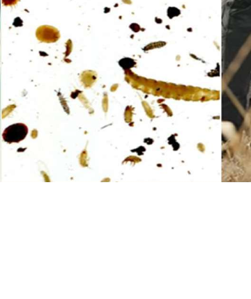

Macrofauna observation focuses on visible soil fauna, including earthworms and other larger organisms that can be collected, observed, counted, or imaged.

{.tool-photo width="48%"}

| Item | Description |
|---|---|
| **What it is** | A field-based biological observation method, potentially supported by image capture. |
| **Main purpose** | To provide a practical biodiversity and biological-condition signal. |
| **Where used** | Field |
| **Typical users** | Researchers, field teams, advanced advisory or participatory users |
| **Typical outputs** | Counts, group presence, images, and biodiversity-related interpretation |

## Main target variables

- earthworm abundance,
- visible macrofauna groups,
- image-based specimen records,
- and broader biological field observations.

## Descriptor groups supported

- biodiversity,
- biological functioning,
- and support for ecological soil-health interpretation.
