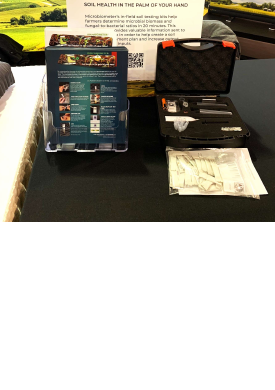

MicroBIOMETER is a kit-based approach that provides a practical view of microbial biomass and the fungal/bacterial balance in soil.

{.tool-photo width="42%"}

| Item | Description |
|---|---|
| **What it is** | A kit-based method for microbial assessment. |
| **Main purpose** | To give users a practical biological indicator linked to microbial biomass and balance. |
| **Where used** | Near-field / laboratory-supported |
| **Typical users** | Researchers, advisors, advanced field users |
| **Typical outputs** | Microbial biomass carbon and balance-related outputs |

## Main target variables

- microbial biomass carbon,
- fungi fraction,
- bacteria fraction.

## Descriptor groups supported

- biodiversity,
- biological functioning,
- and support for soil biological interpretation.
