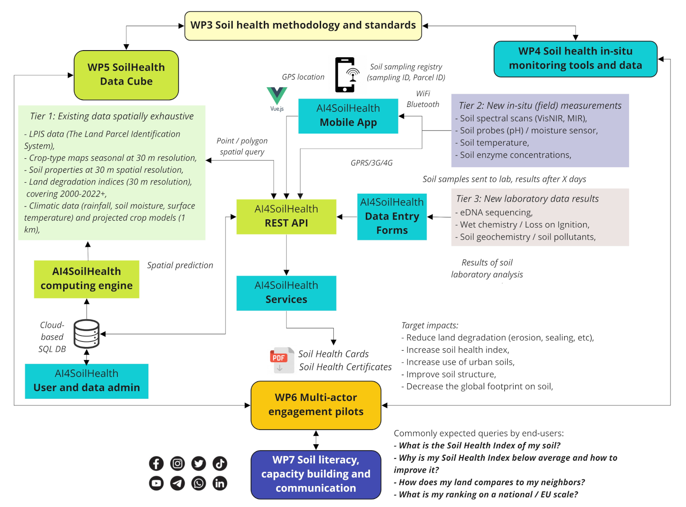

{.tool-photo width="85%" fig-alt="Illustrative workflow linking the Data Cube, app, field observations, laboratory data, and outputs"}

The AI4SoilHealth Toolbox is designed to help users move from a **soil health question** to a **usable result**.

In practice, users do not need to use every tool. The toolbox is modular. A user may combine only a few methods, or may use a fuller workflow involving field assessment, laboratory analysis, and digital interpretation.

## Step 1 - Start with the question

A typical workflow begins with a practical question such as:

- Is this soil affected by salinity?
- Is compaction limiting soil function?
- Is water entering the soil properly?
- How can I assess biological condition?
- Which methods help me understand soil structure or nutrient status?

## Step 2 - Choose the relevant descriptor

The next step is to identify the main soil health theme of interest, for example:

- salinisation,
- soil organic carbon decline,
- compaction,
- nutrient imbalance,
- reduced infiltration,
- acidification,
- contamination,
- or biodiversity.

## Step 3 - Select suitable tools

Once the question is clear, the user can select the most appropriate toolbox components.

Examples:
- for compaction: VESS, bulk density, infiltration
- for salinity: pH / EC / salinity methods, laboratory analysis
- for biodiversity: macrofauna observation, MicroBIOMETER, eDNA, enzyme activity methods

## Step 4 - Collect observations, samples, or measurements

Depending on the chosen tools, the user may:

- make field observations,
- collect soil samples,
- perform rapid field screening,
- use kit-based methods,
- or send samples for laboratory analysis.

## Step 5 - Organise and visualise the information

The digital part of the toolbox helps users:

- record results,
- link them to locations,
- organise observations,
- visualise selected data,
- and connect local information with broader digital context.

## Step 6 - Interpret the results

The toolbox is not about collecting numbers only. It helps users interpret what those results may mean in relation to:

- soil condition,
- visible constraints,
- structural quality,
- chemical stress,
- biological functioning,
- and broader spatial context.

## Step 7 - Produce outputs that can be used or shared

Depending on the workflow, users may end up with:

- field notes and structured observations,
- quantitative measurements,
- comparative results,
- visualised data,
- maps and layers,
- and user-facing outputs such as reports or soil health cards.

## A modular system, not a fixed sequence

Not every user will follow exactly the same sequence.

For example:
- a farmer may rely mainly on practical field tools and selected support,
- a researcher may combine several field, lab, and digital elements,
- an advisor may use rapid methods and digital outputs to support interpretation.

The value of the toolbox lies in helping different users choose methods that fit their purpose.

::: {.note-box}
The toolbox works best when users begin with a clear soil health question and then select the tools that best match it.
:::
